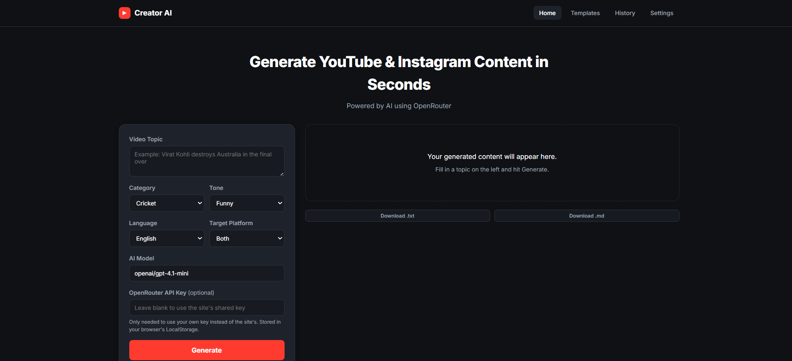
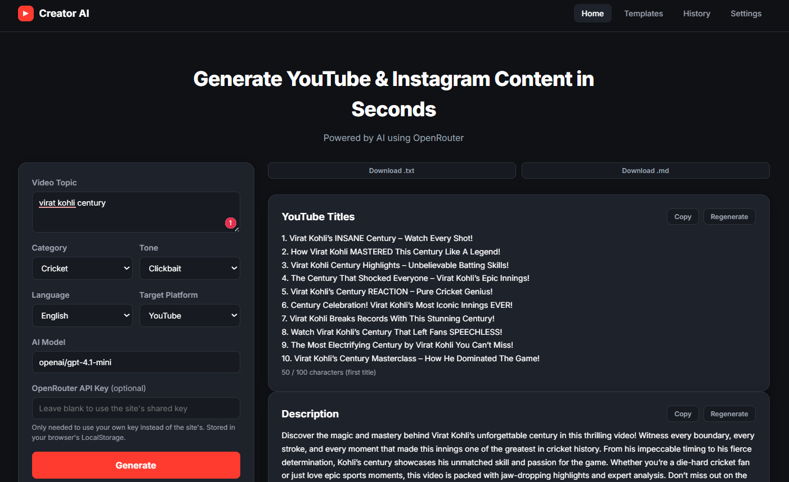
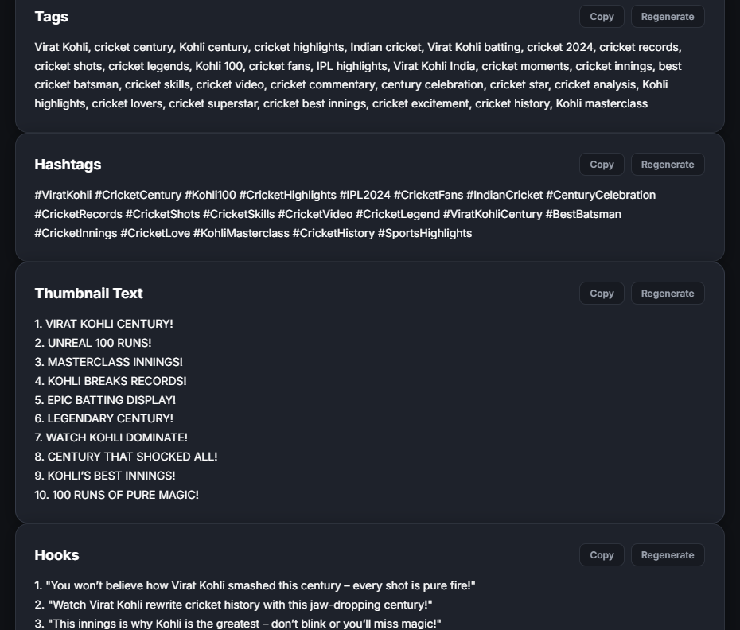
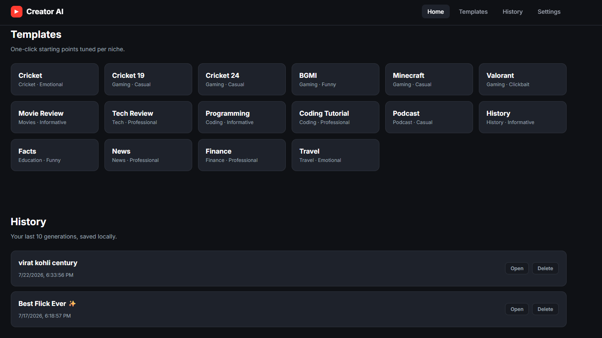

# Creator AI 2.0

A polished, lightweight content-generation experience for creators who need fast, high-quality social media metadata. Creator AI 2.0 helps you craft compelling YouTube and Instagram titles, descriptions, hooks, hashtags, captions, and SEO-ready suggestions in seconds.

## ✨ Highlights

- Generate platform-specific metadata for YouTube and Instagram
- Create engaging hooks, captions, and hashtag sets
- Tailor results by category, tone, language, and platform
- Export content quickly as text or markdown for easy sharing

## 🧠 How it works

The app combines a clean frontend built with HTML, CSS, and vanilla JavaScript with a secure Netlify serverless function. Requests are routed through the backend so your OpenRouter API key remains protected from the browser.

## 🚀 Quick start

1. Clone the project to your local machine.
2. Install the Netlify CLI:

```bash
npm install -g netlify-cli
```

3. Set your environment variable:

```bash
netlify env:set OPENROUTER_API_KEY your_key_here
```

4. Start the local app:

```bash
netlify dev
```

## ☁️ Deploy to Netlify

1. Push the project to GitHub or upload it directly in Netlify.
2. Open Netlify Site settings and add the environment variable `OPENROUTER_API_KEY`.
3. Deploy the site and Netlify will detect the serverless function automatically.

## 🛠️ Project structure

```text
Creator-AI/
├── index.html
├── netlify.toml
├── netlify/functions/generate.js
├── css/style.css
├── js/
│   ├── prompts.js
│   ├── api.js
│   └── script.js
├── assets/
└── README.md
```

## 🔒 Security notes

- Your API key is handled server-side through Netlify environment variables.
- Visitors can optionally provide their own key in the interface.
- A basic per-IP rate limit is included to reduce misuse.

## 📌 Notes

- Recent generations and settings are stored locally in the browser.
- SEO and clickbait scores are lightweight heuristics for visual feedback.
- For production traffic, consider a more persistent rate-limiting strategy.

## 📣 Use it

Enter a topic, choose your preferences, and generate polished content in a single click. You can then copy individual sections or export everything at once.




